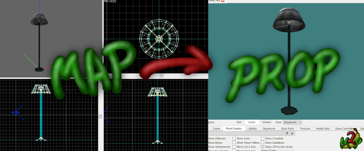

# GoldSrc Map2Prop
{: .no_toc }
 

## Introduction
{: .no_toc }

GoldSrc Map2Prop is a tool for converting .map, .rmf, .jmf and .ol files, as well as .obj files exported from J.A.C.K, to GoldSrc .smd file that can then be compiled into a GoldSrc format studio model without the hassle of using an 3D editor.

It can also be seamlessly integrated with the map compilation process, essentially running as its own compilation tool that'll convert, compile, and replace the brushwork with model props automatically.

 

  

    Table of contents
  

  {: .text-delta }
1. TOC
{:toc}

### Windows Defender False Positive

Unfortunately Windows Defender (and potentially other antiviruses) might flag Map2Prop.exe as a trojan. This is a consequence of using the PyInstaller to package the application. 
I am trying out self-signing the application to see if it makes a difference, but it might take a while before I become a trusted source. You can help out in the meantime by reporting it as a false positive.

You may add an exception for Map2Prop.exe in your antivirus, or if you still don't trust it you're welcome to clone the project, check the files, and [build](https://github.com/Erty-Gamedev/GoldSrc-Map2Prop#building) it yourself.

## Requirements

To use the auto-compile feature one must add a valid reference to a [Sven Co-op studiomdl.exe](http://www.the303.org/backups/sven_studiomdl_2019.rar) either in [config.ini](configini) (recommended) or using the commandline option (`-m`, `--studiomdl`).

### Why is the Sven Co-op studiomdl.exe required for compilation?

The reason for requiring the Sven Co-op studiomdl.exe for compiling these models is because of how map textures work, i.e. they may tile or otherwise extend beyond the UV bounds. Legacy studiomdl.exe compilers will clamp UV coordinates which is no good for this. Additionally, legacy compilers cannot handle CHROME textures that aren't 64x64. Don't worry, the compiled model will still work perfectly fine in vanilla Half-Life.

## How To Use

Either download the latest archive from [Releases](https://github.com/Erty-Gamedev/GoldSrc-Map2Prop/releases/latest) (recommended), or clone this repo and either call map2prop.py directly using a Python launcher or build the project yourself (see [building](https://github.com/Erty-Gamedev/GoldSrc-Map2Prop#building)) to create your own executable.

After that open [config.ini](configini) and ensure the paths to the Steam installation and studiomdl.exe are set up correctly.

### Textures

Map2Prop needs the texture files that are used in the prop to create the models. It will look for the raw BMP textures in both the input file's directory and the output directory, as well as in WAD archives in these directories and the configured game config's mod folder and automatically extract these. 
Additionally one can feed a text file containing paths to WAD archives (one per line) to the commandline argument (`-w`, `--wad_list`) or fill out a `wad list` in [config.ini](configini).

In other words, set the `steam directory` and the relevant `game` and `mod` in [config.ini](configini) and Map2Prop will take care of extracting the textures for you.

### Drag & Drop

A simple way to use Map2Prop is to place the prop(s) to be converted in their own map and drag that map onto the executable.

All brushes will be merged with the worldspawn model unless part of a func_map2prop entity with the `own_model` key set to `1`, which will be placed in their own models.

### Map Compile

By adding the `map2prop.fgd` to the map editor's game configuration one can tie brushes to the `func_map2prop` entity and add the Map2Prop executable to the compilation process (for example Hammer/J.A.C.K's Run Map Expert mode) before/above the CSG compiler and in arguments put `"$path/$file" --mapcompile`.

**Important:** Ensure *Use Process Window* or *Wait for Termination* (or similar) is checked to make sure Map2Prop finishes before the rest of the process continues.

### Commandline Interface

For advanced usage one might run Map2Prop through a shell or command prompt.

To get started with the CLI one can either run Map2Prop with no arguments or call it with `--help` to get a list of available arguments.

## Bug Reports and Feature Suggestions

Take a look at the [Issues](https://github.com/Erty-Gamedev/GoldSrc-Map2Prop/issues) page and make sure the bug/feature hasn't been already been posted.

If the bug/feature is new, feel free to open a new issue. Be as detailed and specific as you can be. 
If it's a bug report, please include the steps for reproducing the issue. Any log files (from /logs) or input map files will be very helpful in investigating the bug.

## Special Thanks

Thanks to Captain P for all the help and advice, as well as showing me the .rmf/.jmf parsing code from MESS (and of course many thanks to MESS for being an excellent resource).
Thanks to Penguinboy for the tips and being very helpful with any questions I've had.
Thanks to Kimilil for help with testing the release candidate and providing excellent feedback and ideas.

### Alpha Testers
Many thanks goes out to the kind people who helped me test this program and provide useful feedback and suggestions during its alpha stage:
* SV BOY
* TheMadCarrot
* Descen
* Kimilil
