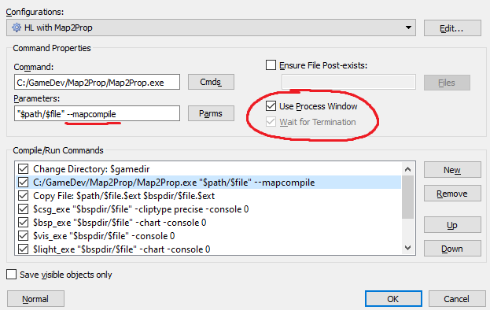

# Releases
 
[Latest (v1.0.0)](#goldsrc-map2prop-v100){: .btn .btn-green }

---

## GoldSrc Map2Prop v1.0.0

Map2Prop Released!

### Changelog:

* Now with map compilation integration!
  * Using the `--mapcompile` argument it can now be used in a map compilation process to automatically produce models from func_map2prop entities and modify the MAP file to convert these to model displaying entities such as `cycler` or `env_sprite`. 
  **NOTE:** Make sure *Use Process Window* or *Wait for Termination* (or similar) is checked to ensure it finishes before the rest of the compilation process proceeds!
  
* Template models
  * No need to create hundreds different models for the same prop.
  The *Template Prop* (`parent_model`) key can be used to point to a func_map2prop entity whose model will be re-used
* The base mod folder will now also be checked for WADs if the mod folder was a SteamPipe folder such as _addon or _downloads
* config.ini, CLI arguments and FGD have been updated and might have incompatible changes
* Targetnames of func_map2prop entities are carried over to converted entities

### Windows: 
[Download Map2Prop1.0.0.7z](releases/Map2Prop1.0.0.7z){: .btn .btn-blue }

---
